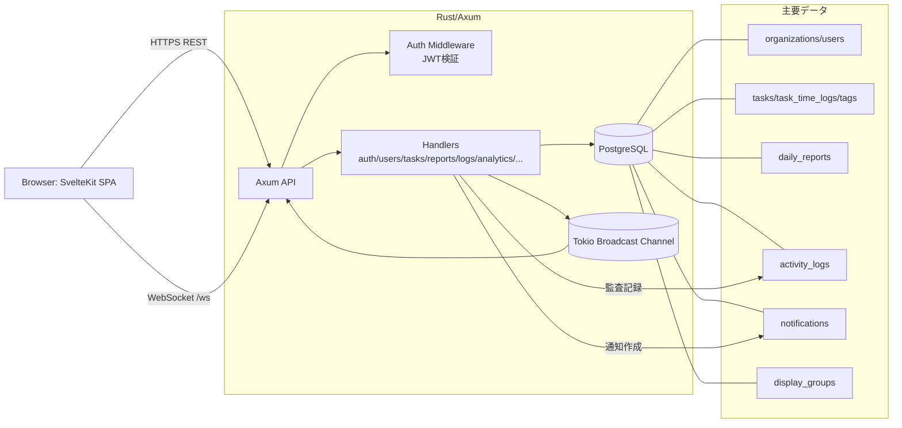

# GlanceFlow システム設計書

最終更新日: 2026-02-22

## 1. システム概要
GlanceFlow は、チームの稼働状況をタイムラインで可視化し、日々のタスク進捗・工数・レポート・監査ログを統合管理する Web アプリケーションです。

- 目的: 「誰が、今、何をしているか」を一瞥で把握し、コミュニケーションコストと管理コストを削減する
- 主なユースケース:
  - 管理者が組織とユーザーを管理し、タスクを割り当てる
  - メンバーが作業ログを記録し、日報を作成・更新する
  - 管理者/メンバーが分析・監査ログ・通知を確認する
- マルチテナント: `organization_id` による論理分離
- 時刻基準: JST（`Asia/Tokyo`）を基準に日次集計・表示

## 2. 技術スタック（Frontend, Backend, DB, etc.）
### Frontend
- SvelteKit (`@sveltejs/kit`)
- Svelte 5 + TypeScript
- Tailwind CSS
- Vitest（ユーティリティテスト）

### Backend
- Rust 2024
- Axum 0.8（REST API + WebSocket）
- SQLx 0.8（PostgreSQL, Migration）
- Tokio（非同期ランタイム）
- tower-http（CORS）

### 認証・セキュリティ
- JWT（`Authorization: Bearer <token>` + WS query token）
- Argon2（パスワードハッシュ）

### Database
- PostgreSQL
- 初期マイグレーション: `backend/migrations/20260215000000_init.sql`

### 想定インフラ（ドキュメント準拠）
- AWS（ECS/App Runner, RDS, S3/CloudFront, Route53, ACM, WAF）

## 3. アーキテクチャ図（Mermaid）

## 4. 主要機能（認証、タスク管理、レポート、ログ、通知など）
### 4.1 認証・アカウント
- `POST /api/auth/register`: 組織 + 初期管理者作成
- `POST /api/auth/login`: ログイン（JWT発行）
- `POST /api/auth/join`: 招待トークンで参加
- `POST /api/auth/forgot-password` / `POST /api/auth/reset-password`: パスワード再設定
- `PATCH /api/users/me/password`: ログインユーザーのパスワード変更

### 4.2 ユーザー/組織管理
- `GET /api/users`: 日付指定でユーザー + 当日の作業ログを取得
- `POST /api/users` / `DELETE /api/users/{id}`: 管理者向けユーザー管理
- `POST /api/invitations` / `GET /api/invitations/{token}`: 招待発行・検証

### 4.3 タスク管理・工数ログ
- `GET/POST/PATCH/DELETE /api/tasks...`
- `POST /api/tasks/time-logs`, `PATCH/DELETE /api/tasks/time-logs/{id}`
- タスクと作業ログを分離管理し、タスク単位で合計稼働時間を集計
- タグ機能（`tags` / `task_tags`）
- 割当時の通知生成 + 監査ログ記録
- WebSocketイベント配信（`task_created`, `task_updated`, `task_deleted`）

### 4.4 レポート
- `GET /api/reports`, `GET /api/reports/{id}`
- `POST /api/reports`: 日報作成（同日同ユーザーはUPSERT）
- `PATCH /api/reports/{id}`: 自分または管理者のみ編集可

### 4.5 監査ログ
- `GET /api/logs`（ページング/条件フィルタ）
- `GET /api/logs/export`（CSV）
- タスク・日報・パスワード変更などを `activity_logs` に記録

### 4.6 通知
- `GET /api/notifications`
- `PATCH /api/notifications/{id}/read`
- `PATCH /api/notifications/read-all`
- 未読優先 + 30日以内既読を取得

### 4.7 分析
- `GET /api/analytics/personal`
- `GET /api/analytics/users/{id}`（admin または本人）
- 完了タスク数、週次比較、ステータス別件数、30日アクティビティヒートマップ

### 4.8 画面構成（主要ルート）
- `/`: タイムラインダッシュボード
- `/register`, `/join`, `/forgot-password`, `/reset-password`
- `/reports`, `/reports/new`, `/reports/[id]`
- `/admin/task-reports`
- `/activity-log`
- `/analytics`

## 5. データベース設計（主要なテーブルとその役割）
### テナント・ユーザー系
- `organizations`: 組織（テナント）
- `users`: ユーザー情報・ロール（admin/user）・認証ID
- `invitations`: 招待トークン管理

### タスク・工数系
- `tasks`: タスク本体（担当者、状態、進捗）
- `task_time_logs`: 実作業時間（start/end、生成列 `duration_minutes`）
- `tags`: 組織内タグ辞書
- `task_tags`: タスク-タグ中間テーブル

### レポート・監査・通知
- `daily_reports`: 日報（`organization_id, user_id, report_date` の一意制約）
- `activity_logs`: 操作履歴（監査証跡）
- `notifications`: ユーザー通知

### 表示制御
- `display_groups`: ユーザー別の表示グループ
- `display_group_members`: 表示グループ所属メンバー

### 補足
- `password_resets` は認証ハンドラで利用される前提テーブル（再設定トークン管理）
- 全体として `organization_id` をキーにデータ分離

## 6. API設計指針
- 認証・認可
  - 保護APIは JWT 必須
  - ロール制御（`admin_only`）をルート層で適用
  - 組織境界は必ず `organization_id` で強制
- HTTP設計
  - 取得は `GET`、作成は `POST`、更新は `PATCH`、削除は `DELETE`
  - 一覧系はページング/フィルタをクエリパラメータで統一
  - CSV出力は `Content-Disposition: attachment`
- エラー設計
  - `StatusCode + String` で返却（現行実装）
  - 入力検証エラーは `400`、認証失敗は `401`、権限不足は `403`
- 一貫性
  - 変更イベントでは `activity_logs` を記録
  - タスク変更は必要に応じて通知とリアルタイムイベントを発火
- 将来改善推奨
  - エラーレスポンスのJSON標準化（code/message/details）
  - OpenAPI スキーマ化

## 7. セキュリティ対策
- 認証・認可
  - JWT署名検証（HS256）
  - admin権限の明示チェック
- パスワード
  - Argon2 でハッシュ化
  - 平文保存なし
- マルチテナント分離
  - すべての主要クエリで `organization_id` による境界管理
- 入力検証
  - ユーザー名文字種制限
  - 日付範囲バリデーション（例: `start_date <= end_date`）
- 通信
  - 現行コードは `CorsLayer::permissive()`（本番では許可オリジン制限が必要）
  - 本番設計書では HTTPS 強制、WAF、Secrets Manager を推奨
- 監査
  - 操作ログを `activity_logs` に蓄積し、CSV出力可能

## 8. 今後の拡張予定（グローバルコンテキストの「次回の新規機能候補」を含む）
`docs/todo.md` の Future Roadmap を次回候補として採用:

1. タスク間依存関係（Connection）の可視化
2. AIによる日報要約・進捗分析
3. WebSocketによる完全リアルタイム同期（現状はポーリング併用）
4. モバイルアプリ版またはPWA対応

加えて、運用拡張（`docs/production_deployment_roadmap.md`）として以下を優先候補:

1. 本番向けCORS制限・セキュアヘッダ適用
2. CI/CDの品質ゲート（lint/test/security scan）
3. 監視・アラート・エラートラッキング（CloudWatch/Sentry）
4. 段階的なDBマイグレーション運用（expand/contract）

---
参照:
- `backend/src/main.rs`
- `backend/src/handlers/*`
- `frontend/src/routes/*`
- `docs/technical_spec.md`
- `docs/requirements.md`
- `docs/todo.md`
- `README.md`
